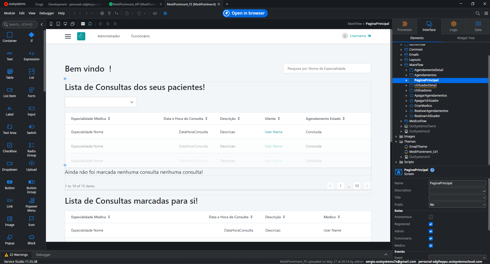

# MediPointment

MediPointment is an application developed in **Outsystems** for scheduling and booking medical appointments. The goal is to make the management of appointments faster and more intuitive for both patients and healthcare professionals.

## Features

- Medical appointment booking
- Scheduling and management of time slots
- Viewing appointment history
- Notifications and reminders for patients
- User profile management (patient and doctor)

## Technologies Used

- **Outsystems Service Studio**: Application interface and logic development
- **Outsystems Integration Studio**: Integration with external services and extensions

## How to Try

1. Install **Outsystems Service Studio** and **Outsystems Integration Studio**. [Download here](https://www.outsystems.com/downloads/)
2. Upload the `MediPointment.oap` and `ConverterUTF8.xif` files from the project. **Note:** The first file is the application, but the second is an important extension that must be implemented in **Outsystems Integration Studio** for the program to work correctly.
3. Publish and run the application in your Outsystems environment.

## Screenshots

## Author

- Miguel Pinto Ribeiro Gonçalves

## License

This project is for portfolio and demonstration purposes only.
